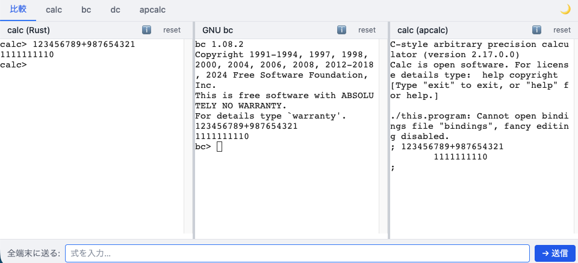

# WebCalc

CLIの計算機をWebAssemblyでブラウザ上で動かし、横並びで比較できるWebアプリです。



## 機能

- **4種類の計算機**をブラウザ上で動作
  - **calc (Rust)** — Rust製の数式評価器。IEEE 754 倍精度演算
  - **GNU bc** — 任意精度の10進演算言語（version 1.08.2）
  - **GNU dc** — RPN（逆ポーランド記法）卓上計算機
  - **calc (apcalc)** — C製の任意精度対話型計算機（version 2.17.0.0）
- **比較タブ** — calc / bc / apcalc を3ペインで並べて同じ式を一括送信して比較
- **個別タブ** — 各計算機を全幅で操作
- **ブロードキャスト** — 下部の入力欄から全端末に同じ式を送信（Enter or 送信ボタン）
- **ドラッグでリサイズ** — 比較タブの各ペイン幅を自由に調整
- **ダークモード対応**

## デモ

https://wtnb75.github.io/webcalc/

## 技術スタック

| カテゴリ | 技術 |
|----------|------|
| フロントエンド | Vue 3 / TypeScript / Tailwind CSS / Pinia |
| ビルドツール | Vite |
| ターミナル | xterm.js + xterm-pty |
| C → WASM | Emscripten (`emscripten/emsdk:latest`) |
| Rust → WASM | wasm-pack (`rust:latest`) |
| タスクランナー | Task (Taskfile.yml) |
| テスト | Vitest + @vue/test-utils（カバレッジ 90%+） |

## セットアップ

### 前提条件

- [Docker](https://www.docker.com/) — WASMビルドに使用
- [Task](https://taskfile.dev/) — タスクランナー
- [pnpm](https://pnpm.io/) v9 — フロントエンド依存管理

### ソースのダウンロード

```sh
task download
```

bc-1.08.2 / calc-0.5.0 / calc-2.17.0.0 のソースアーカイブを取得します。

### WASMビルド

```sh
task build:wasm
```

Dockerコンテナ内でビルドし、`web/public/wasm/` に出力します。ホスト環境への追加インストールは不要です。

### フロントエンドビルド

```sh
task build:web
```

`web/dist/` に静的ファイルが生成されます。

### 全ビルド

```sh
task build
```

### 開発サーバー起動

WASM を事前にビルドしてから実行してください。

```sh
task dev
```

http://localhost:5173/webcalc/ でアクセスできます。

### テスト

```sh
task test
```

## ディレクトリ構成

```
project-webcalc/
├── Taskfile.yml          # タスク定義
├── wasm/
│   ├── bc/               # GNU bc 用 Emscripten Makefile
│   ├── apcalc/           # apcalc 用 Emscripten Makefile
│   └── calc/             # Rust wasm-bindgen ラッパー
├── web/
│   ├── public/
│   │   ├── wasm/         # ビルド済み WASM（gitignore）
│   │   └── workers/      # Web Worker スクリプト
│   └── src/
│       ├── components/   # Vue コンポーネント
│       ├── composables/  # useWasmBridge / useBroadcast
│       ├── stores/       # Pinia store
│       └── types/        # 型定義
├── bc-1.08.2/            # 元ソース（変更しない）
├── calc-0.5.0/           # 元ソース（変更しない）
└── calc-2.17.0.0/        # 元ソース（変更しない）
```

## アーキテクチャ

```
[ブラウザ メインスレッド]
  xterm.js Terminal
     ↕ xterm-pty (openpty / TtyServer)
  [Web Worker]
     ↕ workerTools.js (TtyClient)
  Emscripten WASM (bc / apcalc)

[ブラウザ メインスレッド]
  xterm.js Terminal (エコー・プロンプトは JS 側で制御)
     ↕ onData / write
  wasm-bindgen WASM (calc Rust)
```

- bc / apcalc は Web Worker + SharedArrayBuffer で Emscripten と接続（xterm-pty 経由）
- GitHub Pages の COOP/COEP 制限は `coi-serviceworker` で回避
- calc (Rust) は xterm-pty を使わず JS 側でプロンプト・エコーを制御

## タスク一覧

```sh
task            # タスク一覧を表示
task download   # ソースアーカイブのダウンロード
task build:wasm # WASM を全部ビルド
task build:bc   # GNU bc WASM のみビルド
task build:apcalc # apcalc WASM のみビルド
task build:calc # Rust calc WASM のみビルド
task build:web  # フロントエンドのビルド
task build      # WASM + フロントエンドを全部ビルド
task dev        # 開発サーバー起動
task test       # テスト実行（カバレッジ付き）
task clean      # ビルド成果物を削除
task publish    # GitHub Pages へデプロイ
```

## ライセンス

このリポジトリの Web UI コード（`web/` および `wasm/` 配下）は [MIT License](LICENSE) です。

各計算機本体のライセンスはそれぞれのソースを参照してください。

| 計算機 | ライセンス |
|--------|-----------|
| GNU bc / dc | GPL v3+ |
| calc (apcalc) | LGPL v2.1 |
| calc (Rust) | GPL v3 |
